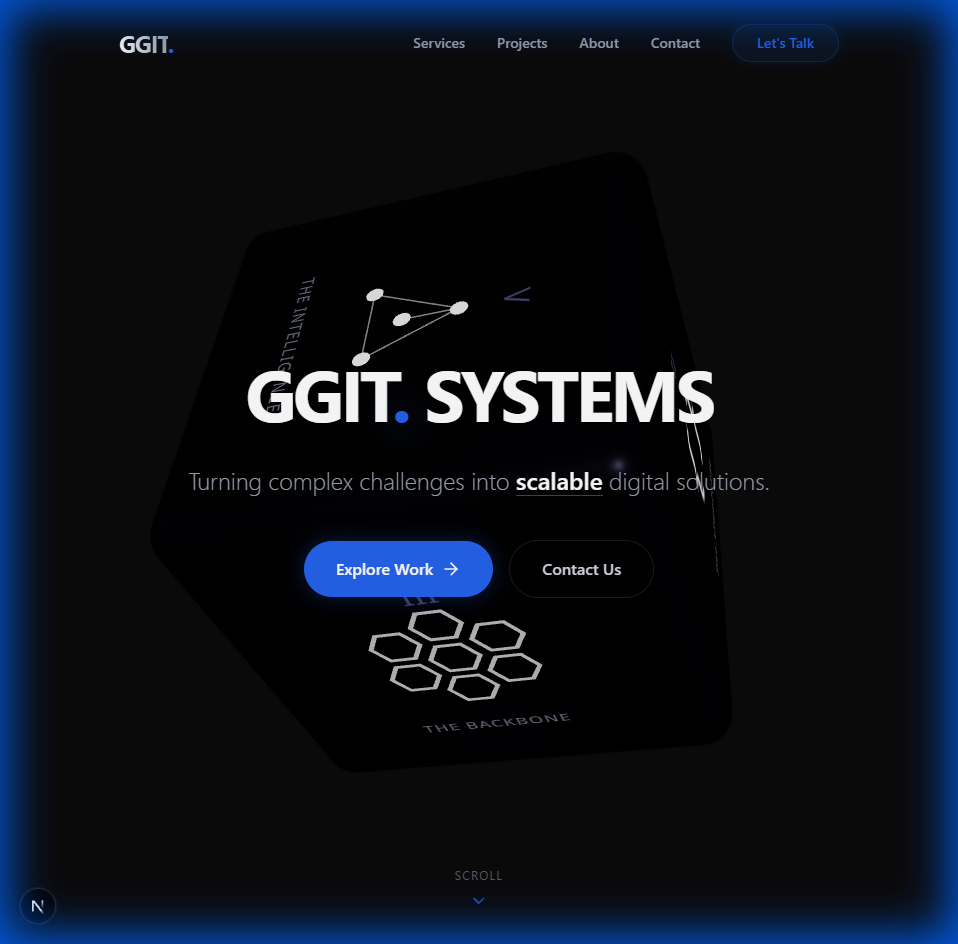

# GGIT Systems | Digital Solutions

> **Engineering the future of digital business.**

A high-performance, premium corporate website for **GGIT Systems**, featuring a modern "Deep Tech" aesthetic, advanced smooth scrolling, and immersive 3D elements.



## 🚀 Key Features

*   **Premium UX/UI:** "Deep Tech" design language with glassmorphism, glowing accents, and electric blue tones.
*   **Physics-Based Smooth Scroll:** Custom implementation using **Lenis** with dynamic duration (slower for long distances) and quartic easing for a luxurious feel.
*   **3D Elements:** Interactive 3D cubes and backgrounds using **React Three Fiber**.
*   **Performance First:** Built on **Next.js 16 (App Router)** and **Turbopack** for lightning-fast navigation.
*   **Responsive:** Fully adaptive layout for mobile, tablet, and desktop.

## 🛠️ Tech Stack

*   **Framework:** [Next.js 16](https://nextjs.org/)
*   **Styling:** [Tailwind CSS v4](https://tailwindcss.com/)
*   **Animations:** [Framer Motion](https://www.framer.com/motion/)
*   **3D Graphics:** [Three.js](https://threejs.org/) / [React Three Fiber](https://docs.pmnd.rs/react-three-fiber)
*   **Smooth Scroll:** [Lenis](https://github.com/darkroomengineering/lenis)

## 📦 Getting Started

1.  **Clone the repository:**
    ```bash
    git clone https://github.com/GabrielPauloT/ggit-web.git
    cd ggit-web
    ```

2.  **Install dependencies:**
    ```bash
    npm install
    ```

3.  **Run the development server:**
    ```bash
    npm run dev
    ```

4.  **Open:** [http://localhost:3000](http://localhost:3000)

## 🎨 Design Philosophy

*   **Color Palette:** Standard Dark Mode (`#0a0a0a`) with Electric Blue (`#2563eb`) and Cyan Glow (`#06b6d4`) accents.
*   **Typography:** Inter (Sans) + JetBrains Mono (Technical/Code).
*   **Motion:** Deliberate, smooth transitions. No instant jumps.

---

© 2026 GGIT Systems. All rights reserved.
